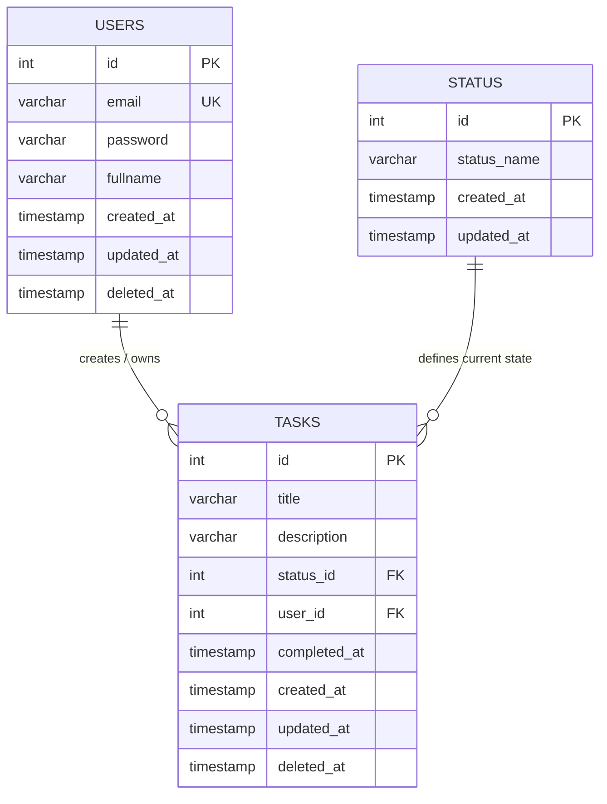
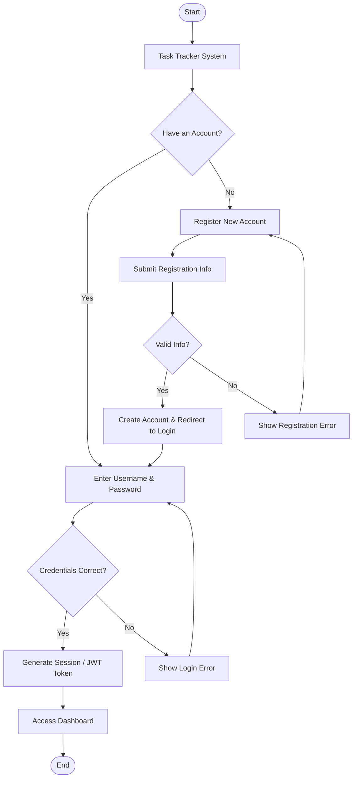
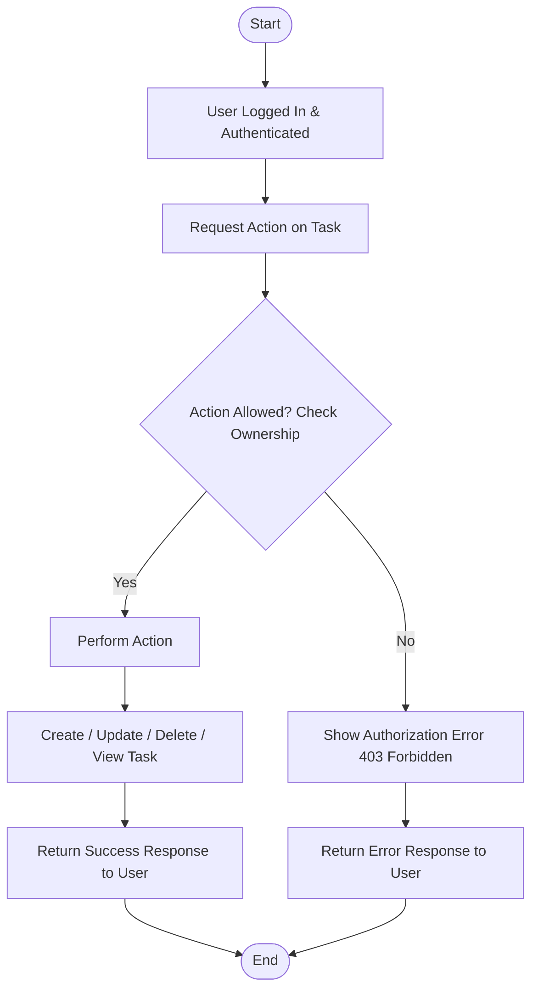
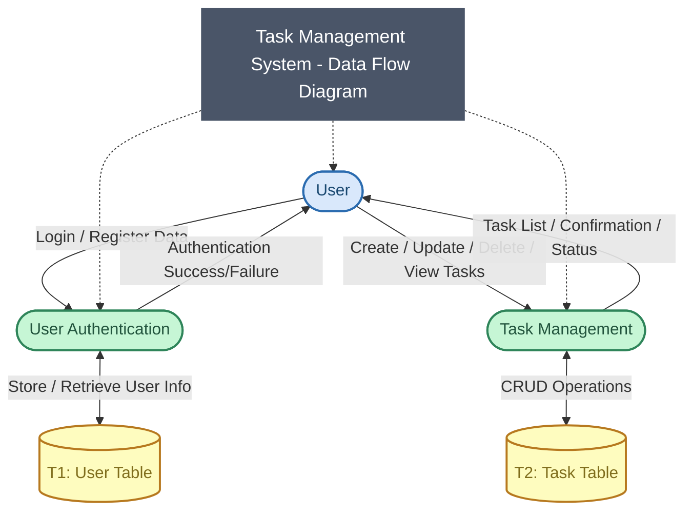

# ER Diagram

```mermaid
erDiagram
    USERS ||--o{ TASKS : "creates / owns"
    STATUS ||--o{ TASKS : "defines current state"

    USERS {
        int id PK
        varchar email UK
        varchar password
        varchar fullname
        timestamp created_at
        timestamp updated_at
        timestamp deleted_at
    }

    TASKS {
        int id PK
        varchar title
        varchar description
        int status_id FK
        int user_id FK
        timestamp completed_at
        timestamp created_at
        timestamp updated_at
        timestamp deleted_at
    }

    STATUS {
        int id PK
        varchar status_name  
        timestamp created_at
        timestamp updated_at
    }
```

# Authentication 

```mermaid
flowchart TD
    Start([Start]) --> A[Task Tracker System]
    A --> B{Have an Account?}
    
    B -->|Yes| C[Enter Username & Password]
    B -->|No| D[Register New Account]
    
    D --> E[Submit Registration Info]
    E --> F{Valid Info?}
    F -->|Yes| G[Create Account & Redirect to Login]
    F -->|No| H[Show Registration Error]
    H --> D
    
    G --> C
    
    C --> I{Credentials Correct?}
    I -->|Yes| J[Generate Session / JWT Token]
    I -->|No| K[Show Login Error]
    K --> C
    
    J --> L[Access Dashboard]
    L --> End([End])
```

# Authorisation

```mermaid
flowchart TD
    Start([Start]) --> A[User Logged In & Authenticated]
    A --> B[Request Action on Task]
    B --> C{"Action Allowed? Check Ownership"}
    
    C -->|Yes| D[Perform Action]
    C -->|No| E[Show Authorization Error 403 Forbidden]
    
    D --> F[Create / Update / Delete / View Task]
    F --> G[Return Success Response to User]
    E --> H[Return Error Response to User]
    
    G --> End([End])
    H --> End([End])
```

# Data Flow Diagram

```mermaid
flowchart TD

    Title[Task Management System - Data Flow Diagram]:::title

    User([User]):::entity

    P1([ User Authentication]):::process
    P2([ Task Management]):::process

    D1[(T1: User Table)]:::datastore
    D2[(T2: Task Table)]:::datastore

    User -->|"Login / Register Data"| P1
    P1 <-->|"Store / Retrieve User Info"| D1
    P1 -->|"Authentication Success/Failure"| User

    User -->|"Create / Update / Delete / View Tasks"| P2
    P2 <-->|"CRUD Operations"| D2
    P2 -->|"Task List / Confirmation / Status"| User

    Title -.-> User & P1 & P2

    classDef title fill:#4a5568,stroke:none,color:#fff,font-size:18px,text-align:center;
    classDef entity fill:#d9e8fb,stroke:#2b6cb0,stroke-width:2px,color:#1a4971;
    classDef process fill:#c6f6d5,stroke:#2f855a,stroke-width:2px,color:#22543d;
    classDef datastore fill:#fefcbf,stroke:#b7791f,stroke-width:2px,color:#7f6d1c;
```
