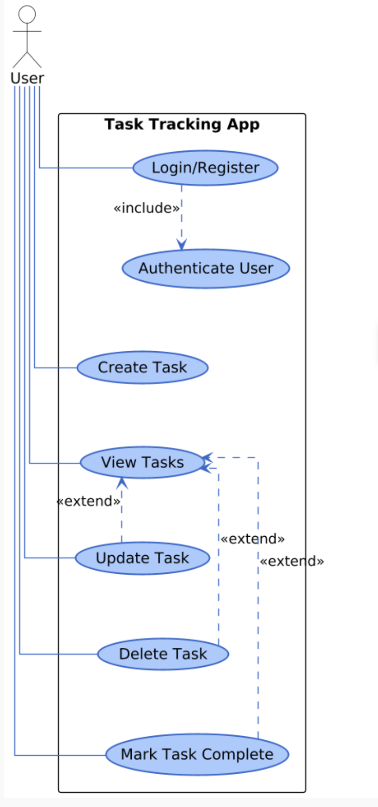

# Use Case Documentation

---
## Business Use Cases

| **Use Case** | **Business Value** |
|--------------|------------------|
| **Personal Task Management** | - Helps individuals stay organized and focused on daily priorities. - Reduces the chance of forgetting important tasks. - Encourages consistent productivity habits. |
| **Goal Tracking** | - Improves time management and goal tracking. - Reduces procrastination by providing actionable to-do tasks. - Increases motivation through visible task tracking. |
| **Cross-Device Task Synchronization** | - Enables consistent experience across devices. - Increases convenience for users switching between phone and computer. - Ensures data reliability and keeps tasks up to date. |
| **Offline Productivity Management** | - Ensures uninterrupted productivity. - Reduces dependency on constant internet connectivity. - Enhances user trust through reliability in all conditions. |
| **Daily Planning and Habit Building** | - Encourages personal discipline and accountability. - Helps users visualize daily achievements. - Supports habit formation through repetition and visibility. |

---
## Technical Use Cases

### Use Case 1: User Registration

| **Field** | **Description** |
|------------|----------------|
| **Actors** | New User |
| **Precondition** | User is not registered |
| **Trigger** | Tap **Sign Up** |
| **Main Flow** | 1. User enters **email** and **password**. 2. Application creates an account. 3. User is redirected to login page. |
| **Postcondition** | Account created successfully. |

---

### Use Case 2: Login

| **Field** | **Description** |
|------------|----------------|
| **Actors** | Registered User |
| **Precondition** | Account already exists |
| **Trigger** | Tap **Login** |
| **Main Flow** | 1. User enters credentials. 2. Application verifies credentials. 3. User session is activated. 4. User is redirected to the **Dashboard**. |
| **Postcondition** | Secure session is active. |

---

### Use Case 3: Add Task

| **Field** | **Description** |
|------------|----------------|
| **Actors** | Logged-in User |
| **Precondition** | User is authenticated |
| **Trigger** | Tap **Add Task** |
| **Main Flow** | 1. User fills **Task Title** and **Description**. 2. Task is saved and added. 3. UI updates in real time across devices. |
| **Postcondition** | Task is visible on all connected devices. |

---

### Use Case 4: Edit / Update Task

| **Field** | **Description** |
|------------|----------------|
| **Actors** | Logged-in User |
| **Precondition** | Task exists and belongs to the user |
| **Trigger** | Tap **Edit** |
| **Main Flow** | 1. Modal opens with pre-filled fields. 2. User edits details and taps **Save**. 3. UI refreshes instantly across devices. |
| **Postcondition** | Task is updated across all devices. |

---

### Use Case 5: Delete Task

| **Field** | **Description** |
|------------|----------------|
| **Actors** | Logged-in User |
| **Precondition** | Task exists and is owned by the user |
| **Trigger** | Tap **Delete** |
| **Main Flow** |1. A confirmation snackbar appears with an **Undo** option for 5 seconds. 2. If the user doesn’t undo within that time, the task is permanently deleted. 3. The task is then smoothly removed from the UI.|
| **Postcondition** | Task permanently deleted. |

---

## Use Case Diagram

---

